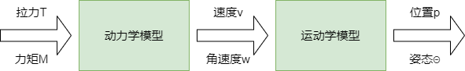

# 四旋翼飞行器建模及控制

## 摘要

本文基于牛顿-欧拉方程建立四旋翼飞行器的动力学和运动学模型，从而得到四旋翼飞行器的飞行控制刚体模型并设计了X型四旋翼无人机的控制系统，在simulink里仿真验证。

## 1 四旋翼飞行器建模

### 1 .1 基本假设

1. 四旋翼飞行器是均匀对称的刚体
2. 四旋翼飞行器的质量和转动惯量不发生改变
3. 四旋翼飞行器的几何中心与其重心重合
4. 四旋翼飞行器只受重力和螺旋桨拉力

### 1.2 动力学及运动学模型

建立四旋翼飞行器模型的目的在于分析四旋翼飞行器在受到外力、外力矩的情况下，其位置和姿态的变化情况。

​                                                                               图1 四旋翼飞行器的飞行控制刚体模型

其中，动力学模型的输入为螺旋桨提供的拉力和力矩，输出为四旋翼的速度和角速度；运动学模型的输入为动力学模型的输出，即四旋翼的速度和角速度，输出为四旋翼的位置和姿态。

### 1.3 坐标系

我们将用到两个坐标系，即惯性坐标系（静坐标系）——**地面坐标系**，以及非惯性坐标系（动坐标系）——**机体坐标系**。两个坐标系都遵循右手法则。

​                                                                                            图2 地面坐标系和机体坐标系

**地面坐标系**原点为飞行器起始点，轴$O_{e}$$Z_{e}$​​铅锤向下，轴$O_{e}$$X_{e}$​​方向为起飞前飞行器机头方向，轴$O_{e}$$Y_{e}$​​方向为起飞前飞行器机头右侧方向。

**机体坐标系**取飞行器重心位置$O_{b}$$Z_{b}$​​为坐标原点，其与四旋翼飞行器固连， 轴$O_{b}$$X_{b}$​​方向为飞行器机头方向。

### 1.4 旋转矩阵

旋转矩阵可以将机体坐标系下表示的向量转变到地面坐标系下表示，任一向量从机体坐标系 $O_{b}$$Y_{b}$$Z_{b}$​​ 到地面坐标系 $O_{e}$$Y_{e}$$Z_{e}$​​ 的旋转矩阵表示为：

$$
R_{b}^{e} = \begin{bmatrix}
 cos\theta cos\psi & cos\psi sin\theta sin\phi-sin\psi cos\phi & cos\psi sin\theta cos\phi+sin\psi sin\phi \\
 cos\theta sin\psi & sin\psi sin\theta sin\phi+cos\psi cos\phi & sin\psi sin\theta cos\phi-cos\psi sin\phi\\
 -sin\theta & sin\phi cos\theta  & cos\phi cos\theta 
\end{bmatrix}
$$
$R_{b}^e$​​右下角的b表示机体坐标系，右上角的e表示地面坐标系。

​                                                                                                  图3 欧拉角

$\psi$​——绕 Z 轴旋转的偏航角（angle of yaw)

$\theta$——绕 Y 轴旋转的俯仰角（angle of pitch)

$\phi$——绕 X 轴旋转的滚转角（angle of roll)

### 1.5 牛顿欧拉方程

**刚体运动=质心的平动+绕质心的转动**

**质心的平动**用牛顿第二定律描述，即：
$$
F = m\ast \frac{\mathrm{d} v}{\mathrm{d} t}
$$
**绕质心的转动**由欧拉方程描述，即：
$$
M = J\dot{w}+w\times Jw
$$
物理含义为：作用在刚体上的合力矩 M 使得刚体以角速度 $\omega$ 、角加速度 $\dot{w}$ 旋转

### 1.6 四旋翼飞行器的动力学模型

动力学模型的输入为合外力、合外力矩，输出为速度、角速度。我们假设飞行器只受重力和螺旋桨拉力。

#### 1.6.1 位置动力学模型

根据牛顿第二定律
$$
m\dot{v}^{e}=G^{e}+T^{b}
$$
式中, $\dot{v}$与G右上角的e代表这是地面坐标系下的向量，T右上角的b代表这是机体坐标系下的向量。由于拉力是由螺旋桨产生的，与四旋翼飞行器固连，故在机体坐标系下表示。

等式两边同时除以m：
$$
\dot{v}^{e}=g^{e}+\frac{T^{b}}{m}
$$
将机体坐标系下的拉力转换到地面坐标系，左乘旋转矩阵即可：
$$
\dot{v}^{e}=g^{e}+R_{b}^{e}\frac{T^{b}}{m}
$$
展开成矩阵形式，其中g与T都是标量，g为重力加速度，T为四个螺旋桨产生的总升力：
$$
\begin{bmatrix}
 \dot{v}_{x}\\
 \dot{v}_{y}\\
 \dot{v}_{z}
\end{bmatrix}=g\begin{bmatrix}
  0\\
  0\\
  1
\end{bmatrix}+\frac{1}{m}\ast \begin{bmatrix}
 cos\theta cos\psi & cos\psi sin\theta sin\phi-sin\psi cos\phi & cos\psi sin\theta cos\phi+sin\psi sin\phi \\
 cos\theta sin\psi & sin\psi sin\theta sin\phi+cos\psi cos\phi & sin\psi sin\theta cos\phi-cos\psi sin\phi\\
 -sin\theta & sin\phi cos\theta  & cos\phi cos\theta 
\end{bmatrix}\ast\begin{bmatrix}
 0\\
 0\\
 -T
\end{bmatrix}
$$
整理得：
$$
\left\{\begin{array}{l}
\dot{v}_{x}=-\frac{T}{m}(\cos \psi \sin \theta \cos \phi+\sin \psi \sin \phi) \\
\dot{v}_{y}=-\frac{T}{m}(\sin \psi \sin \theta \cos \phi-\cos \psi \sin \phi) \\
\dot{v}_{z}=g-\frac{T}{m} \cos \phi \cos \theta
\end{array}\right.
$$

#### 1.6.2 姿态动力学模型

由欧拉方程可得
$$
\boldsymbol{J} \dot{\boldsymbol{\omega}}^{b}+\boldsymbol{\omega}^{b} \times \boldsymbol{J} \boldsymbol{\omega}^{b}=\boldsymbol{G}_{a}^b+\boldsymbol{\tau}^b
$$
式中， $\omega^b$​​​ 表示在机体坐标系下的角速度； $G_a$​​​ 表示陀螺力矩； $\tau$​​​ 表示螺旋桨在机体轴上产生的力矩，包括绕 $O_bX_b$​​​ 轴的滚转力矩 $\tau_x$​​​ 、绕 $O_bY_b$​​​轴的俯仰力矩  $\tau_y$​​​ 以及绕 $O_bZ_b$​​​ 轴的偏航力矩  $\tau_z$​​​ 。

**角速度** $\omega^b$ ：通常用 p,q,r 来表示 $\omega^b$ 在机体轴上的三个分量： $\omega^x$,$\omega^y$,$\omega^z$ ，即：
$$
\boldsymbol{\omega}^{b}=\left[\begin{array}{l}
\omega_{x}^b \\
\omega_{y}^b \\
\omega_{z}^b
\end{array}\right]=\left[\begin{array}{l}
p \\
q \\
r
\end{array}\right]
$$
**陀螺力矩** Ga ：当电机高速旋转的时候，相当于一个陀螺。高速旋转的陀螺是非常稳定的个体，具有保持自身轴向不变的能力。
$$
\boldsymbol{G}_{\boldsymbol{a}}=\left[\begin{array}{c}
G_{a, \phi} \\
G_{a, \theta} \\
G_{a, \psi}
\end{array}\right]=\left[\begin{array}{c}
J_1 q\left(\varpi_{1}-\varpi_{2}+\varpi_{3}-\varpi_{4}\right) \\
J_1 p\left(-\varpi_{1}+\varpi_{2}-\varpi_{3}+\varpi_{4}\right) \\
0
\end{array}\right]
$$
式中，$J_1$表示整个电机转子和螺旋桨绕机体转轴的总转动惯量；$\varpi_{1}, \varpi_{2}, \varpi_{3}, \varpi_{4}$​表示螺旋桨 1,2,3,4 的转速。

基于假设1**惯性矩阵** **J**可表示为：
$$
\boldsymbol{J}=\left[\begin{array}{rrr}
I_{x x} & -I_{x y} & -I_{x z} \\
-I_{x y} & I_{y y} & -I_{y z} \\
-I_{x z} & -I_{y z} & I_{z z}
\end{array}\right]=\left[\begin{array}{lll}
I_{x x} & & \\
& I_{y y} & \\
& & I_{z z}
\end{array}\right]
$$
可得：
$$
\left[\begin{array}{lll}
I_{x x} & & \\
& I_{y y} & \\
& & I_{z z}
\end{array}\right]\left[\begin{array}{l}
\dot{p} \\
\dot{q} \\
\dot{r}
\end{array}\right]+\begin{bmatrix}
 p & q & r \\
 I_{xx}p & I_{yy}q & I_{zz}r\\
 i & j & k
\end{bmatrix}=\left[\begin{array}{c}
J q\left(\varpi_{1}-\varpi_{2}+\varpi_{3}-\varpi_{4}\right) \\
J p\left(-\varpi_{1}+\varpi_{2}-\varpi_{3}+\varpi_{4}\right) \\
0
\end{array}\right]+\begin{bmatrix}
 \tau_x\\
 \tau_y\\
 \tau_z
\end{bmatrix}
$$
整理得：
$$
\left\{\begin{array}{l}
\dot{p}=\frac{1}{I_{x x}}\left[\tau_{x}+q r\left(I_{y y}-I_{z z}\right)-J_1 q \Omega\right] \\
\dot{q}=\frac{1}{I_{y y}}\left[\tau_{y}+p r\left(I_{z z}-I_{x x}\right)+J_1 p \Omega\right] \\
\dot{r}=\frac{1}{I_{z z}}\left[\tau_{z}+p q\left(I_{x x}-I_{y y}\right)\right]
\end{array}\right.
$$
式中：$\Omega=-\varpi_{1}+\varpi_{2}-\varpi_{3}+\varpi_{4}$

### 1.7 四旋翼飞行器的运动学模型

运动学模型的输入为速度和角速度，输出为位置和姿态。

速度与位置的方程：
$$
\left\{\begin{array}{l}
\dot{\boldsymbol{p}}^{e}=\boldsymbol{v}^{e} \\
\boldsymbol{p}^{e}=\left[\begin{array}{lll}
x & y & z
\end{array}\right]^{T} \\
\left[\begin{array}{lll}
\dot{x} & \dot{y} & \dot{z}
\end{array}\right]^{T}=\left[\begin{array}{lll}
v_{x} & v_{y} & v_{z}
\end{array}\right]^{T}
\end{array}\right.
$$
姿态角的变化率与机体的旋转角速度有如下关系:
$$
\left\{\begin{array}{l}
\dot{\boldsymbol{\Theta}}=\boldsymbol{W} \cdot \boldsymbol{\omega}^{b} \\
\dot{\boldsymbol{\Theta}}=\left[\begin{array}{lll}\dot{\phi} & \dot{\theta} & \dot{\psi}\end{array}\right]^{T} \\
\omega^b = \left[\begin{array}{lll}p & q & r\end{array}\right]^{T} \\
\boldsymbol{W}=\left[\begin{array}{ccc}
1 & \tan \theta \sin \phi & \tan \theta \cos \phi \\
0 & \cos \phi & -\sin \phi \\
0 & \sin \phi / \cos \theta & \cos \phi / \cos \theta
\end{array}\right]
\end{array}\right.
$$
整理可得：
$$
\left[\begin{array}{l}
\dot{\phi} \\
\dot{\theta} \\
\dot{\psi}
\end{array}\right]=\left[\begin{array}{ccc}
1 & \tan \theta \sin \phi & \tan \theta \cos \phi \\
0 & \cos \phi & -\sin \phi \\
0 & \sin \phi / \cos \theta & \cos \phi / \cos \theta
\end{array}\right]\left[\begin{array}{l}
p \\
q \\
r
\end{array}\right]
$$
姿态角的变化率与机体的旋转角速度关系 [详细推导](https://blog.csdn.net/bitaohu/article/details/80358773?utm_medium=distribute.pc_relevant.none-task-blog-BlogCommendFromMachineLearnPai2-1.control&depth_1-utm_source=distribute.pc_relevant.none-task-blog-BlogCommendFromMachineLearnPai2-1.control)

在小扰动情况下姿态角的变化率与机体的旋转角速度近似相等，即：
$$
\left[\begin{array}{c}
\dot{\phi} \\
\dot{\theta} \\
\dot{\psi}
\end{array}\right]=\left[\begin{array}{c}
p \\
q \\
r
\end{array}\right]
$$

### 1.8 四旋翼飞行器的飞行控制刚体模型

四旋翼飞行器的飞行控制刚体模型由动力学模型和运动学模型结合而成。

位置的模型：
$$
\left\{\begin{array}{l}
\ddot{x}=-\frac{T}{m}(\cos \psi \sin \theta \cos \phi+\sin \psi \sin \phi) \\
\ddot{y}=-\frac{T}{m}(\sin \psi \sin \theta \cos \phi-\cos \psi \sin \phi) \\
\ddot{z}=g-\frac{T}{m} \cos \phi \cos \theta
\end{array}\right.
$$
姿态的小扰动模型：
$$
\left\{\begin{array}{l}
\ddot{\phi}=\frac{1}{I_{x x}}\left[\tau_{x}+q r\left(I_{y y}-I_{z z}\right)-J_1 q \Omega\right] \\
\ddot{\theta}=\frac{1}{I_{y y}}\left[\tau_{y}+p r\left(I_{z z}-I_{x x}\right)+J_1 p \Omega\right] \\
\ddot{\psi}=\frac{1}{I_{z z}}\left[\tau_{z}+p q\left(I_{x x}-I_{y y}\right)\right]
\end{array}\right.
$$
联合动力学模型和运动学模型也可以表达为以下形式：
$$
\left\{\begin{array}{l}
\dot{\boldsymbol{p}}^{e}=\boldsymbol{v}^{e} \\
\dot{\boldsymbol{v}}^{e}=g^e-\frac{1}{m} \boldsymbol{R}_{b}^{e} T^e \\
\dot{\boldsymbol{\Theta}}=\boldsymbol{W} \cdot \boldsymbol{\omega}^{b} \\
\boldsymbol{J} \dot{\boldsymbol{\omega}}^{b}=-\boldsymbol{\omega}^{b} \times \boldsymbol{J} \boldsymbol{\omega}^{b}+\boldsymbol{G}_{\boldsymbol{a}}+\boldsymbol{\tau}
\end{array}\right.
$$

## 2 四旋翼飞行器控制

仿真环境中使用的飞机是 **parrot mini drone**

### 2.1  搭载的传感器

1. **超声波传感器**：安装在无人机底部，他可以发出高频的声波然后测量这个声波要多久时间从地面反弹回传感器，以此来测量无人机距离地表的高度。
2. **相机**：安装在无人机底部，可以基于光流法计算无人机水平方向的移动速度。
3. **气压传感器**：安装在无人机内部，可以间接测量飞机的海拔高度。
4. **惯性测量单元(IMU)**: 可以测量无人机三轴姿态角及加速度。

### 2.2 控制器设计要求

目标位姿为我们希望无人机达到的位姿，包含目标点以及目标姿态。系统状态包括无人机三轴坐标以及姿态角，由传感器测量数据处理后得到。我们需要设计一个控制器，它可以结合反馈回来的系统状态和目标位姿输出四个电机的转速，从而改变施加在无人机身上的力与力矩，使无人机达到目标姿态。

 ### 2.3 控制原理

无人机有六个自由度，分别为三轴方向上的平移与绕三轴的旋转。四旋翼无人机的姿态和平动是耦合的，如果想控制无人机左移，必须要先让无人机发生滚转。因此该系统是一种典型的欠驱动，强耦合系统。

#### 2.3.1 悬停

悬停状态是四旋翼无人机具有的一个显著的特点。在悬停状态下，四个旋翼具有相等的转速，产生的上升合力正好与自身重力相等。并且因为旋翼转速大小相等，对角旋翼转速方向相同，从而使得飞行器总扭矩为零，使得飞行器静止在空中，实现悬停状态。

#### 2.3.2 垂直方向

在保证四旋翼无人机每个旋转速度大小相等的倩况下，同时对每个旋翼增加或减小大小相等的转速，便可实现飞行器的垂直运动。当同时増加四个旋翼转速时，使得旋翼产生的总升力大小超过四旋翼无人机的重力时，四旋翼无人机便会垂直上升；反之，当同时减小旋翼转速时，使得每个旋翼产生的总升力小于自身重力时，四旋翼无人机便会垂直下降，从而实现四旋翼无人机的垂直升降控制。

#### 2.3.3 偏航

增加四旋翼绿色旋翼转速，减小红色旋翼转速，保持升力不变。保持对角旋翼转速相同时，其便不会发生俯仰或滚动运动。根据角动量守恒，两组旋翼转速不同时，会导致反扭矩力的不平衡，此时便会产生绕机身中心轴的反作用力矩。如图所示，当绿色旋翼转速大于红色旋翼转速时，因为前者沿逆时针方向旋转，后者相反，总的反扭矩沿顺时针方向，引起顺时针偏航运动；反之，则会引起飞行器的逆时针偏航运动。

#### 2.3.4 滚转

增加四旋翼某侧旋翼转速，减小另一侧旋翼转速实现的，保持升力不变。通过改变左右侧的旋翼转速，使得左右旋翼之间形成一定的升力差，从而使得沿飞行器机体X轴上产生一定力矩。如图所示，增加左侧旋翼的转速，减小右侧旋翼转速，则飞行器倾斜向右侧飞行；相反，增加右侧旋翼的转速，减小左侧旋翼转速，则飞行器向左倾斜飞行。

#### 2.3.5 俯仰

增加四旋翼某侧旋翼转速，减小另一侧旋翼转速实现的，保持升力不变。通过改变前后侧的旋翼转速，使得前后旋翼之间形成一定的升力差，从而使得沿飞行器机体Y轴上产生一定力矩。如图所示，增加前侧旋翼的转速，减小后侧旋翼转速，则飞行器倾斜向后侧飞行；相反，增加后侧旋翼的转速，减小前侧旋翼转速，则飞行器向前倾斜飞行。

#### 2.3.6 电机混合算法

垂直方向的运动、偏航、滚转、俯仰四种运动可以解除耦合。综上所述，四旋翼无人机的各个飞行状态的控制是通过控制对称的四个旋翼的转速，形成相应不同的运动组合实现的。该算法通过混合四种运动的指令输出每个电机的转速，后续会详细介绍。
$$
\begin{array}{l}
Motor_{\text{front right}} = Thrust_{cmd} +Yaw_{cmd}+Pitch_{cmd}+Roll_{cmd}\\
Motor_{\text{front left}}= Thrust_{cmd} -Yaw_{cmd}+Pitch_{cmd}-Roll_{cmd}\\
Motor_{\text{back right}}= Thrust_{cmd} -Yaw_{cmd}-Pitch_{cmd}+Roll_{cmd}\\
Motor_{\text{back left}}= Thrust_{cmd} +Yaw_{cmd}-Pitch_{cmd}-Roll_{cmd}
\end{array}
$$

### 2.4 控制器

**内环路**：因为垂直方向的运动、偏航、滚转、俯仰四种运动可以解除耦合，为此分别设计四个PID单独控制这四种运动，此时已经可以控制无人机的高度与姿态。

**外环路**：控制俯仰与滚转运动以间接控制无人机的位置X与Y，因此设计了串联PID，第一级PID的输出分别为目标俯仰角与目标滚转角。

位置控制器需要偏航角的原因是我们需要将地面坐标系下的目标坐标(X,Y)转化到机体坐标系下。

## 3 Simulink实现

Matlab Tech talk系列基于asbQuadcopter项目讲解，MIT也在一门控制课程上使用该项目讲解四旋翼控制原理。我在此项目的基础上做了二次开发实现了简单的状态机：设立目标点让无人机向右飞，飞行途中相机检测到红色物体后降低高度悬停。

### 3.1 项目框架

整个系统分为六个部分，重点讲述控制部分，其余部分略讲。

#### 3.1.1 目标点设置

**pose_ref**设置无人机目标点。

#### 3.1.2 环境参数设置

该部分设置了仿真环境的重力加速度、空气温度、音速、气压、空气密度、磁场强度。

#### 3.1.3 非线性四旋翼模型

该部分即为我们第一部分推导过的四旋翼飞行器的刚体模型，它依据控制系统输出的四个电机转速以及仿真环境参数输出四旋翼无人机的速度、角速度、姿态角、加速度、角加速度等状态。

#### 3.1.4 传感器数据

该部分依据非线性四旋翼模型输出的速度、角速度、姿态角、加速度、角加速度等状态和仿真环境的参数输出无人机搭载的传感器数据。

#### 3.1.5 可视化

该部分负责将无人机的状态可视化的显示出来。

#### 3.1.6 飞行控制系统

控制系统有三个输入：飞行目标点、传感器数据、图像数据。输出为四个电机的转速。

##### 3.1.6.1 图像处理系统

使用Blob分析检测红色物体，检测到后将landing flag置为True。

##### 3.1.6.2 传感器信息处理

利用卡尔曼滤波结合传感器数据计算出无人机的位置、角速度、姿态角、加速度、角加速度等状态。

##### 3.1.6.3 控制模块

控制模块与2.4的控制器一致。

控制高度的模块如下。值得注意的是无人机的重力被作为常量加入PID的输出。这里的微分项与常规PID的实现不同，因为微分项会放大噪声，这里将卡尔曼滤波估计出来的Z轴加速度作为微分项，可以有效减少噪声。

控制位置XY的如下所示，需要利用偏航角Yaw将地面坐标系下的XY轴差值转化到机体坐标系下。

电机混合算法如下，Controller.Q2Ts是电机混合算法的矩阵，可以通过PID控制器里的参数补偿，也可以通过系统辨识的方法得到。

### 3.2 数据记录分析

如下图，图中最上方曲线表示无人机Y坐标变化，可以发现沿无人机Y轴正方向前进，在识别到红色物体后保持静止。

中间的橘黄色曲线表示无人机X轴坐标变化，一直保持在很小的状态，接近于0。

最下方的曲线表示无人机Z轴坐标变换，在识别到红色物体后稳定悬浮在2m高度。中间出现抖动是因为相机识别到红色物体后，无人机迅速下降导致相机视野内红色物体丢失，无人机又迅速上升。

## 4 结语

记录一下四旋翼建模控制的学习过程，也希望能帮助到想要了解相关知识的朋友。写的不对的地方请斧正，感觉自己对控制理论的研究还是不够深入。

[个人博客网址](zjlzjl.com)

## 参考文献

1. 建模部分参考：[玖辞丶的文章](https://zhuanlan.zhihu.com/p/349306054) 
2. 控制部分参考：[Matlab tech talk系列无人机仿真与控制](https://www.youtube.com/watch?v=hGcGPUqB67Q)

